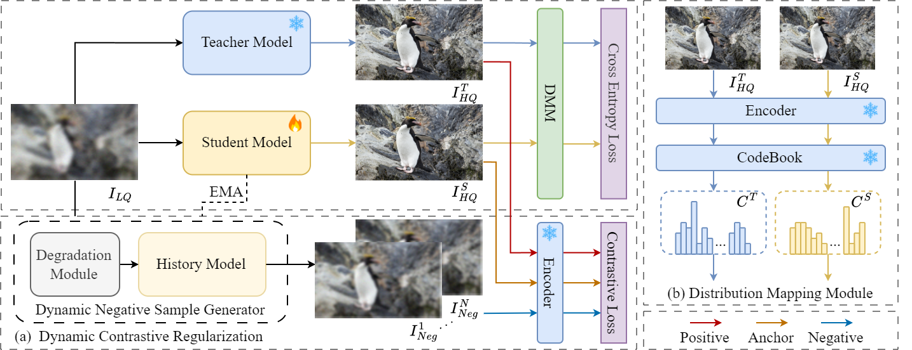

# Dynamic Contrastive Knowledge Distillation for Efficient Image Restoration

[](https://arxiv.org/abs/2412.08939) 

> **Abstract:** 
Knowledge distillation (KD) is a valuable yet challenging approach that enhances a compact student network by learning from a high-performance but cumbersome teacher model. However, previous KD methods for image restoration overlook the state of the student during the distillation, adopting a fixed solution space that limits the capability of KD. Additionally, relying solely on L1-type loss struggles to leverage the distribution information of images. In this work, we propose a novel dynamic contrastive knowledge distillation~(DCKD) framework for image restoration. Specifically, we introduce dynamic contrastive regularization to perceive the student's learning state and dynamically adjust the distilled solution space using contrastive learning. Additionally, we also propose a distribution mapping module to extract and align the pixel-level category distribution of the teacher and student models. Note that the proposed DCKD is a structure-agnostic distillation framework, which can adapt to different backbones and can be combined with methods that optimize upper-bound constraints to further enhance model performance. Extensive experiments demonstrate that DCKD significantly outperforms the state-of-the-art KD methods across various image restoration tasks and backbones.



## News

- **Jan 23, 2025:** Training codes is released.

## Preparation

### Install

1. Create a new conda environment
```
conda create -n dckd python=3.8
conda activate dckd
```

2. Install dependencies
```
conda install pytorch==1.10.0 torchvision==0.11.0 torchaudio==0.10.0 cudatoolkit=11.3 -c pytorch
pip install -r requirements.txt
python setup.py develop
```

### Download

VQGAN model **checkpoints** can be downloaded from

[https://github.com/CompVis/taming-transformers](https://heibox.uni-heidelberg.de/d/8088892a516d4e3baf92/)

Teacher model **checkpoints** can be downloaded from

- SwinIR: [https://github.com/JingyunLiang/SwinIR/releases](https://github.com/JingyunLiang/SwinIR/releases)
  - 001_classicalSR_DIV2K_s48w8_SwinIR-M_x2.pth
  - 001_classicalSR_DIV2K_s48w8_SwinIR-M_x3.pth
  - 001_classicalSR_DIV2K_s48w8_SwinIR-M_x4.pth

## Train

Run the following script to train the model:

```sh
python -m torch.distributed.launch --nproc_per_node=4 --master_port=4321 basicsr/train.py -opt options/train/SwinIR/train_SwinIR_SRx2_DCKD.yml --launcher pytorch
```

More training configs can be found in `./options`. 

## Test

Run the following script to test the trained model:

```sh
python basicsr/test.py -opt options/test/SwinIR/test_SwinIR.yml
```

## Citation

If you find this work useful for your research, please cite our paper:

```bibtex
@article{zhou2024dynamic,
  title={Dynamic Contrastive Knowledge Distillation for Efficient Image Restoration},
  author={Zhou, Yunshuai and Qiao, Junbo and Liao, Jincheng and Li, Wei and Li, Simiao and Xie, Jiao and Shen, Yunhang and Hu, Jie and Lin, Shaohui},
  journal={arXiv preprint arXiv:2412.08939},
  year={2024}
}
```
